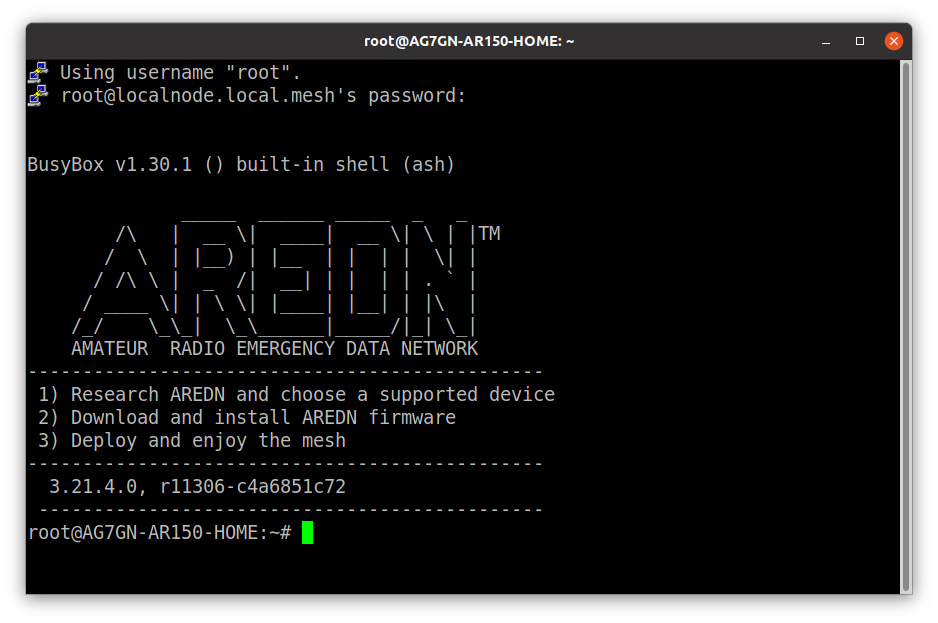

# AREDN Notes

VERSION 20210718

AUTHOR Steve Magnuson, AG7GN

## Setting up Putty for ssh Access to your `localnode`

This is for Windows users. Linux/Mac users can just use `ssh` in the Console. However, there is a version of putty for Linux. 

### Install Putty

- [Download the MSI](https://www.chiark.greenend.org.uk/~sgtatham/putty/latest.html) (Windows Installer). Linux users: Use the package manager for your distribution to install it.
-  Double-click the downloaded file to run the installer

### Run Putty

- You should see a screen similar to the following (screenshots are from a Linux host)
	

### Configure a session for your `localnode`

1. Click __Connection__ and change __Seconds between keepalives__ to `60`

	

2. Click __Connection > Data__, enter `root` in __Auto-login username__

	

3. Click __Window__ and change:

	- __Lines of scrollback__ to `100000` (or whatever value you want)
	- Optionally change the number of __Columns__ and __Rows__

	

4. Click __Window > Fonts__

	- Click the __Change...__ button next to the __Font used for ordinary text__ field
	- Select desired font, style, size
	- Click __OK__

	

5. Click __Session__

	- Enter `localnode.local.mesh` in the __Host Name__ field
	- Enter `2222` in the __Port__ field
	- Enter `localnode` in the __Saved Sessions__ field

	

	- Click __Save__. 
	- `localnode` should now appear in the __Saved Sessions__ list
	
	
	
6. Double-Click `localnode` in the __Saved Sessions__ list, or select it and click the __Open__ button. The following window with similar text will appear the first time you connect.

	
	
	- Click __Accept__ to cache the your node's SSH key
	
7. Login with your node's password

	
	
	- Successful login looks similar to this:
	
	

## AREDN OLSR "Under the Hood"

### OLSR State JSON Output

All Services Available on the Mesh: [http://localnode.local.mesh/cgi-bin/sysinfo.json?services=1](http://localnode.local.mesh/cgi-bin/sysinfo.json?services=1)

Local Node's Services: [http://localnode.local.mesh/cgi-bin/sysinfo.json?services_local=1](http://localnode.local.mesh/cgi-bin/sysinfo.json?services_local=1)

Nodes on the Mesh: [http://localnode.local.mesh:8080/cgi-bin/sysinfo.json?hosts=1](http://localnode.local.mesh:8080/cgi-bin/sysinfo.json?hosts=1)

Routes: [http://localnode.local.mesh:9090/routes](http://localnode.local.mesh:9090/routes)

OLSR State: [http://localnode.local.mesh:9090/all](http://localnode.local.mesh:9090/all)

### Services Cache

You might notice that other nodes have services listed in their mesh status that your node advertised at one time, but that you have since removed or changed.  [This thread](https://www.arednmesh.org/content/services-not-being-deleted) explains what is going on.  Excerpt:

"...OLSR uses a timeout to clear the cache on all nodes of a service that is no longer advertising itself.  As long as a node is alive on the mesh, the caches will not clear.  If the node is off the mesh for a period of about 10 mins (ie. not advertising itself to all other nodes), then, other nodes realize that the node (and all of it's services) has gone offline and removes all entries for that node (including services)."

So, to force all other nodes on the mesh to flush the list of services that they learned from your node, you must remove your node from the mesh for 10+ minutes.

Of course, as an alternative, you could contact the owners of all the other nodes and have them reboot their nodes to flush their cache, but that would be a lot of work!

## ADVANCED: Adding hostnames to the DNS configuration on an AREDN node

Note that names you add in this way will only be resolvable by your local node, not by other nodes on the mesh.  I have a submitted an [enhancement request](https://github.com/aredn/aredn_ar71xx/issues/516) to the AREDN team to add this feature so it'll work on the entire mesh.

1. SSH to your AREDN node (TCP port 2222, remember).

1. Add your hostnames to `/etc/hosts.user`.  Example:

		10.27.190.3	w7ecg-meet
		10.27.190.3	w7ecg-info
		10.27.190.3	w7ecg-help
		
1. Add this line to `/etc/dnsmasq.conf`:

		addn-hosts=/etc/hosts.user
		
1. Restart `dnsmasq`:

		service dnsmasq restart
		

