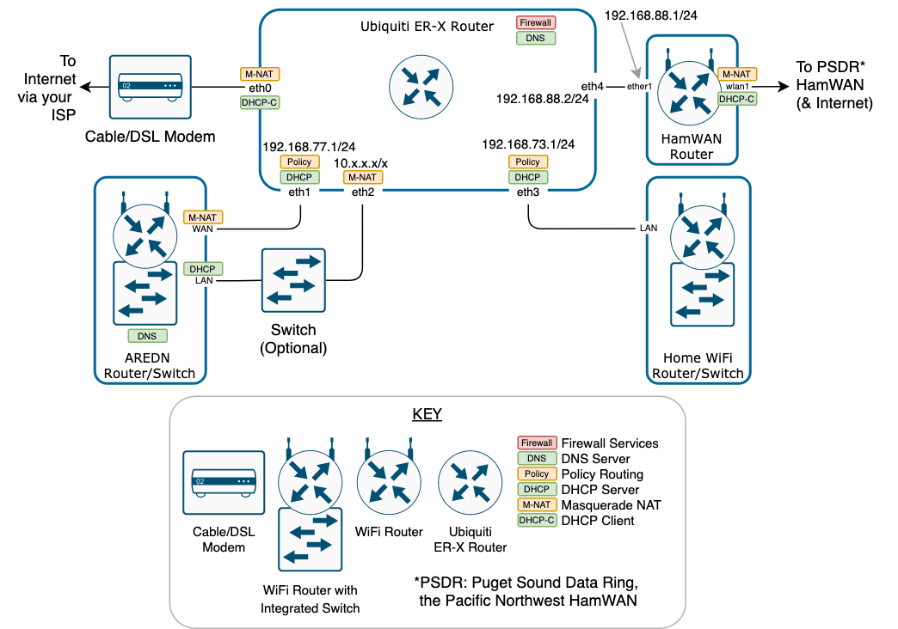

# Integrating AREDN and HamWAN with your Home Network

VERSION: 20200722

AUTHOR:  Steve Magnuson AG7GN

This document describes one way to have your home network and Internet service peacefully coexist with AREDN and HamWAN networks.  If you have HamWAN or AREDN or both networks and want to connect them together in a reasonably safe way, this document is for you.

We will be introducing a new "brain" into your home network - a routing device that will manage security, IP addresses and routing between the Internet, your home network, HamWAN and AREDN.  This device is the [Ubiquiti ER-X router](https://www.ui.com/edgemax/edgerouter-x/).

## Disclaimer

This is a long and somewhat complicated procedure.  To increase your chances of success, read through the entire document before you attempt to make changes so you'll know what you're about to undertake.  Following this procedure introduces considerable change to your home network, including renumbering your home network IP addresses.  This will disrupt your current Internet access.  Proceed at your own risk!

## Prerequisites

- Amateur radio license (needed for AREDN and HamWAN)
- [AREDN](https://www.arednmesh.org/) router [hardware](https://www.arednmesh.org/content/supported-platform-matrix) that has both LAN and WAN and optionally DtDLink ports. The [GL.iNet GL-AR150](https://www.amazon.com/GL-iNet-GL-AR150-Pre-installed-Performance-Programmable/dp/B015CYDVG8) and [GL.iNet GL-AR750](https://www.amazon.com/GL-iNet-GL-AR750-300Mbps-pre-Installed-Included/dp/B07712LKJM) are good inexpensive choices for those just starting out in AREDN.
- The AREDN image is installed and operational on your AREDN router and you can access it's web interface.  [These instructions](https://arednmesh.readthedocs.io/en/latest/arednGettingStarted/installing_firmware.html) will guide you in getting the image installed.
- [HamWAN](http://hamwan.org/) hardware connected to HamWAN per the [recommended configuration](http://hamwan.org/Standards/Network%20Engineering/Client%20Node%20Configuration.html).  
- You are connected to HamWAN and can access your HamWAN router's command line interface (CLI) via SSH.
- [Ubiquiti ER-X router](https://www.ui.com/edgemax/edgerouter-x/). Other Ubiquiti EdgeRouters will also work, but may require a more complicated configuration because the number of physical ports varies from model to model. Some models and may require an external VLAN-aware ("managed") switch.
- Garden-variety home router + switch + access point device (likely your current router).
- Internet service via a cable or DSL modem.
Note that I'm talking about a MODEM here, not an integrated modem and router provided by your ISP.  We want the Ubiquiti ER-X to do the routing and other related functions. It is possible to integrate an ISP-provided router into this design, but it's more complicated than what I describe here.  Do yourself a favor (and save some money) and return the ISP's router and get a cable modem if you can. Customers who get phone service from the cable company may be stuck with the ISP's router (sorry!).
- Familiarity with configuring your home router, HamWAN and AREDN equipment.
- Cat5 or better ethernet cables of suitable length.
- PC with a wired ethernet port, and you know how to configure the ethernet port on your PC with a static IP address or an automatically assigned IP (DHCP) address. We'll be doing both in this procedure.

## Background

A typical home network consists of a cable or DSL modem and a WiFi router. The router provides Network Address Translation (NAT), firewall and IP address management (using Dynamic Host Configuration Protocol, or DHCP) services. Residential class routers typically require minimal networking knowledge and configuration to get you on the Internet.

When we add AREDN and/or HamWAN to the mix, things get complicated quickly. Some additional knowledge is required in order for these networks to coexist without interfering with each other or, in the case of AREDN and HamWAN, stray too far from Part 97 rules. Making this work also requires an enterprise class router - your average Best Buy router isn't going to work.

This document describes one method to integrate these 3 networks at your QTH in a way that:

- Retains all the normal functions of your home network through your regular ISP.
- Routes network traffic that is best sent via HamWAN through HamWAN and not your regular ISP.
- Allows devices on your home network to access your local AREDN devices or devices on AREDN mesh by IP address or by device (host) name, but prevents AREDN devices from accessing your home network.
- Allows devices on your AREDN network to use HamWAN for Internet access.

I won't explain every networking principle underlying the design described in this document because the document would be a hundred pages long and I don't have that kind of time!  Where appropriate, I've provided links to external resources where you can learn more about the underlying technology.

For HamWAN and Ubiquiti equipment, I'll provide the necessary commands or instructions to make this work, so you will need command line interface (CLI) access to your HamWAN and Ubiquiti equipment.  The Ubiquiti ER-X router provides a CLI in it's web interface or via [Secure Shell](https://www.ssh.com/ssh/) (SSH).  For the HamWAN router, use SSH to get to the CLI. There are minimal changes needed to the HamWAN router and you can use the `Winbox` application (if you're using a Windows PC) instead of SSH to make those changes. This procedure only documents using SSH to edit the HamWAN router.

I'm making these assumptions about your current network:

- You have a typical Internet connection consisting of a cable or DSL modem and a *separate* WiFi/router/switch. Your WiFi/router/switch's WAN port is plugged into the cable or DSL modem's "LAN" or "NETWORK" port and it is working correctly.
- You have one or both of these:
	- A working HamWAN router that is connected to the HamWAN network but not connected to your home network.
	- A working AREDN router that is not connected to your home network. See the [AREDN Getting Started Guide](https://arednmesh.readthedocs.io/en/latest/arednGettingStarted/aredn_overview.html) to install the AREDN image on your hardware.
- You have a new Ubiquiti ER-X that is still at factory default settings. You can [reset to factory defaults](https://help.ubnt.com/hc/en-us/articles/205202620-EdgeRouter-Reset-to-Factory-Defaults) if necessary.

## Diagram

Here's what we're going to build:

### Address Assignments

We'll be assigning these IP addresses to the ER-X interfaces shown in this diagram:

ER-X `eth0`: Address assigned via DHCP from your ISP

ER-X `eth1`: `192.168.77.1/24` 

ER-X `eth2`: `10.1.1.1/24 (we will change this value later)`

ER-X `eth3`: `192.168.73.1/24`

ER-X `eth4`: `192.168.88.2/24`

## Definitions

- __CLI__: Command Line Interface.  This is where you enter the commands on the networking devices.  Connecting to your device via [Secure Shell](https://www.ssh.com/ssh/) (SSH) is the typical way to access the CLI.
- __DHCP__: [Dynamic Host Configuration Protocol](https://www.lifewire.com/what-is-dhcp-2625848) is a service provided by certain network devices that manages the IP addresses used by the devices on networks. Every device on a network must have an IP address in order to work, and DHCP provides a way to automatically assign IP address and related information to devices when they join a network. A DHCP server connected to your local network provides this IP address management service to the devices on your local network. We will be configuring a DHCP server on the ER-X router.
- __DHCP-C__: DHCP Client. This is a network interface on a device that is configured to query a DHCP server to obtain it's IP address information. By default, the network interface on PCs, smartphones, tablets, etc. are DHCP clients. If DHCP is not used on a network interface, then the IP address information must be configured manually. This is called a static IP address configuration.
- __DNS__: [Domain Name System](https://www.cloudflare.com/learning/dns/what-is-dns/) is the "phone book of the Internet". It translates between a name and an IP address. For example, google.com's IP address is 172.217.14.206.  We will be configuring a DNS server on the ER-X, and that DNS server will provide DNS services to your home network and allow you to access devices on the AREDN network by name.
- __Firewall__: A [firewall](https://www.cisco.com/c/en/us/products/security/firewalls/what-is-a-firewall.html) protects your network from devices on other networks by monitoring all of the network traffic (packets) flowing between your network and the Internet (for example), and only allows traffic that you define to pass. We will be configuring a firewall on the ER-X router.
- __LAN__: [Local Area Network](https://www.howtogeek.com/353283/what-is-a-local-area-network-lan/). A network to which your devices are directly or wirelessly connected.
- __M-NAT__: Masquerade [Network Address Translation](https://en.wikipedia.org/wiki/Network_address_translation) translates IP addresses between your private home and AREDN networks to a single public IP address provided to you by your ISP and by the HamWAN administrators.
- __Policy__: A device with an IP address on your network needs to talk to another device on the Internet.  Somehow, it needs to know how to get that traffic (a series of data packets) to the destination device's IP address.  Routers maintain tables of blocks of IP addresses called [subnets](https://www.subnetting.net/Tutorial.aspx). Routers perform the basic function of [routing](https://study-ccna.com/what-is-ip-routing/) packets. So, as long as your device knows how to contact it's local router, it sends the traffic to the router and the router then knows where to send it. We are going to configure some [policy routing](https://en.wikipedia.org/wiki/Policy-based_routing) on the ER-X router so we can make routing decisions based on criteria other than just the destination IP address.
- __Private IP addresses__: [Private IP addresses](https://www.lifewire.com/what-is-a-private-ip-address-2625970) are certain ranges of IP addresses that are typically used on home networks. The blocks of private IP address are defined in a standards document called [RFC1918](https://tools.ietf.org/html/rfc1918).

## Roadmap

1. Configure the ER-X so it can become the router/firewall for your network instead of your current WiFi/router/switch.

1. Convert your current WiFi/router/switch to be a WiFi/switch operating in "bridge" mode.
1. Insert the ER-X between your cable/DSL modem and your WiFi/switch.
1. Verify your home network devices can reach the Internet in the new configuration.
1. Make some changes to your AREDN and HamWAN routers so they can integrate with your home network.
1. Add to the ER-X configuration to make it ready to accept connection to your HamWAN router and AREDN router.
1. Connect your HamWAN and AREDN routers to the ER-X.
1. Finish the ER-X configuration.

## Procedure

### Configure ER-X Router - Part 1

1. It's likely that when your ER-X router arrives, it'll have an older version of firmware. Using a PC with Internet access, visit the EdgeRouter [downloads](https://www.ui.com/download/edgemax) page. You'll see a lot of files on that page.  We're interested in the most recent version for the `EdgeRouter ER-X/ER-X-SFP/EP-R6/ER-10X` models.  As of this writing, the latest version is `v2.0.8-hotfix.1`. You may see more than one firmware file for the ER-X listed.  Look for the most recent version. Click the corresponding download link and save it to your PC. Use this same PC to configure the ER-X in the following steps, or transfer the downloaded firmware file to the PC you'll be using in the following steps.

1. You'll need to initially configure the ER-X in isolation from your home network - just the ER-X, a PC and an ethernet cable.  
	- [Watch this video](https://www.youtube.com/watch?v=aECPxlT6Qq4) for a good overview of how to connect your PC to the ER-X and how to use the "wizard" in the ER-X web interface to do the initial configuration.

		__NOTE: *We'll be configuring the wizard differently than what is shown in the video!*__ Watch the video just to get a general idea of the steps. Don't execute the steps with the settings shown on the video on your own router.
		
1. Connect your PC to the ER-X `eth0` port and assign your PC's ethernet port the static IP address (`192.168.1.2`) as shown in the video.

__NOTE__: The ER-X web interface uses pop up windows and your browser may be blocking those.  If you find that certain screens are not what they shodEnable pop-ups in your browser while configuring the ER-X
1. Log in to the ER-X web page at `192.168.1.1` as shown in the video. The default username and password are both `ubnt`.
1. Let's see if we need to update the firmware on your ER-X.  In the upper left of the web page and to the right of the EdgeMax icon, it'll tell you the version. If the version shown is older than the version you downloaded in the first step, upgrade the firmware on your ER-X as follows:

	- If prompted to run the Basic Setup wizard, click __No__.
	- Click the __System__ button at the bottom of the page.
	- Scroll down to the __Configuration Management & Device Maintenance__ section.
	- Click the __Upload system image: Upload a File__ button.
	- Select the new firmware file you downloaded earlier.
	- Follow the instructions provided on the screen to complete the firmware update.
	- After the router reboots, log back in to the ER-X web page.
	
1. If you are prompted to run the wizard, click __Yes__. If you're not prompted to run the Wizard, click the __Wizards__ button in the upper right, then click __Basic Setup__.

	

1. Configure the Internet port as shown. The configuration shown is for a cable modem.  Note that if you are using a DSL modem, you likely are using __PPPoE__, and so you'll select that rather than __DHCP__. You'll need to provide your PPPoE credentials, too.

	
	
1. Scroll down to the __DNS Forwarding__ section and make these changes:

	- For DNS servers, select __Use servers provided by the Internet Service Provider__
	- Uncheck __Use ony one LAN__.
	
	
	
1. Click on __Configure this section__ to expand the "(Optional) Secondary LAN ports (eth1)" and do the same for "LAN ports (eth2, eth3, eth4)". Set the IP addresses as shown below.  

	

1. Scroll down to the __User setup__ section.  *CHANGE THE PASSWORD* for the `ubnt` user!

		

1. Click __Apply__.  Scroll down in the pop-up window and click __Apply Changes__.

	
	
1. Another pop-up appears.  Scroll down and click __Reboot__.

	
	
1. Click __Yes, I'm sure__.

	
	
1. Move your PC's ethernet cable from `eth0` to `eth1` on the ER-X and change your ethernet adapter's IP address setting to "Obtain an IP address automatically" as shown in the video. 

1. Wait a minute or so for the router come back up, then go to https://192.168.77.1 in your browser. Log in with user `ubnt` and your new password.

1. Click the __CLI__ button (CLI is Command Line Interface) in the upper right, and log in again as user `ubnt` and your new password. The rest of the ER-X configuration will be done in the CLI.

	

1. We're going to enable NAT and IPSec offloading to improve performance as described in the video. Then we'll detach `eth2, eth3` and `eth4` from the ER-X internal switch and make them their own router ports, each with it's own IP address. We'll also tell the ER-X to listen for DNS requests on your home LAN port `eth3`. Enter these commands in the CLI:

		configure
		set system offload hwnat enable
		set system offload ipsec enable
		set interfaces ethernet eth1 description 'AREDN WAN'
		delete interfaces switch switch0 switch-port interface eth2
		delete interfaces switch switch0 switch-port interface eth3
		delete interfaces switch switch0 switch-port interface eth4
		delete service dns forwarding listen-on switch0
		delete interfaces switch switch0 address 10.1.1.1/24
		set interfaces ethernet eth2 address 10.1.1.1/24
		set interfaces ethernet eth2 description 'AREDN LAN'
		set interfaces ethernet eth3 address 192.168.73.1/24
		set interfaces ethernet eth3 description 'Home LAN'
		set interfaces ethernet eth4 address 192.168.88.2/24
		set interfaces ethernet eth4 description 'HamWAN'
		set service dns forwarding listen-on eth3
		commit;save
		
	Ignore any warning messages for now, but make sure you don't see any error messages.  If you see error messages, make sure you entered all the commands above as shown. The configuration will not save if there are errors.
	
1. Next, we adjust the ER-X DHCP server settings. We enable the DHCP server only on the HOME LAN ER-X network.

		set service dhcp-server hostfile-update enable
		delete service dhcp-server shared-network-name LAN1
		delete service dhcp-server shared-network-name LAN2
		set service dhcp-server shared-network-name HOME_LAN authoritative enable
		set service dhcp-server shared-network-name HOME_LAN subnet 192.168.73.0/24 default-router 192.168.73.1
		set service dhcp-server shared-network-name HOME_LAN subnet 192.168.73.0/24 dns-server 192.168.73.1
		set service dhcp-server shared-network-name HOME_LAN subnet 192.168.73.0/24 lease 86400
		set service dhcp-server shared-network-name HOME_LAN subnet 192.168.73.0/24 start 192.168.73.50 stop 192.168.73.250
		set service dhcp-server shared-network-name HOME_LAN subnet 192.168.73.0/24 domain-name home.lan
		commit;save
	
1. We'll configure the ER-X to be a forwarding DNS server for your Home LAN. We will set up the ER-X DNS to forward requests to Internet DNS servers and then configure certain DNS settings. Ubiquiti routers use the open source `dnsmasq` forwarding DNS server. See the [`dnsmasq` documentation](http://www.thekelleys.org.uk/dnsmasq/docs/dnsmasq-man.html) for a description of what these parameters do.  

	Note the lines below that contain `...domain=home.lan...`. That establishes a DNS 'zone' for your home network, so your devices at home will have names like `mypc.home.lan` and `iphone.home.lan` when they connect to your home network.  You can change `home.lan` to something else if desired.  The `name-server` IP addresses are servers at [Cloud Flare](https://www.cloudflare.com), a provider of reliable Internet DNS services.

	Enter these commands in the CLI:

		set service dns forwarding name-server 1.1.1.1
		set service dns forwarding name-server 1.0.0.1
		set service dns forwarding name-server '2606:4700:4700::1111'
		set service dns forwarding name-server '2606:4700:4700::1001'
		set service dns forwarding options bogus-priv
		set service dns forwarding options domain-needed
		set service dns forwarding options expand-hosts
		set service dns forwarding options localise-queries
		set service dns forwarding options strict-order
		set service dns forwarding options domain=home.lan,192.168.73.0/24,local
		set service dns forwarding options domain=home.lan,192.168.77.0/24,local
		set service dns forwarding options no-resolv
		set service dns forwarding options selfmx
		set service dns forwarding options filterwin2k
		set service dns forwarding system
		set system name-server 127.0.0.1
		set system name-server '::1'
		commit;save;exit

1.	Set your PC's ethernet port to automatically obtain an IP address.
		
### Reconfigure your Current WiFi/Router/Switch (WRS)

*These steps will disable Internet at your QTH.*  

I'm going to call your current "WiFi/Router/Switch" __WRS__ from now on to save typing.

Every WRS manufacturer has a different procedure for what we're about to do, so there's no way to provide explicit instructions for this step.  Write down what you did so you can recover if necessary.

1. Disconnect your PC from the ER-X and plug it in to a LAN port on your WRS.  
1. Open a browser and log in to your WRS web interface.
1. Save a backup copy of your router's configuration if it has such a feature, and know how to do a factory reset on your WRS in case something goes awry.
1. Disconnect your WRS "WAN" or "Internet" port from your cable/DSL modem.  
1. Disable the router function on your WRS.  Manufacturers typically call this changing to "bridge" or "access point" mode as opposed to the mode it's likely in now, "router" mode.  
1. Disable the DHCP server function.  This is *CRITICAL*, because we want the ER-X to be the DHCP server, not your WRS, and there can only be one DHCP server on a network at a time.  
1. Set your WRS's LAN IP address to STATIC with these values:

	- IP Address: `192.168.73.254`
	
	- Netmask/Subnet mask: `255.255.255.0`
	
	- Gateway/Router: `192.168.73.1`
	
	- DNS Server: `192.168.73.1`
1. Reboot your WRS.
1. Disconnect your PC from the WRS.

### Test Home LAN Internet Connectivity

Now we'll test your home LAN connection through the ER-X. Your PC should still be connected to your WRS.

1. Plug your cable/DSL modem ethernet cable into your ER-X port `eth0`.
1. Plug your ER-X port `eth3` into a LAN (*not* WAN) port on your WRS.
1. Plug your PC into a LAN port on your WRS.
1. Verify your PC obtains IP address information (`192.168.73.x`) from the ER-X and see if you can get to the Internet.  NOTE: You may need to reboot your cable/DSL modem for this to work.  
	
	- *Don't move on to the next steps until you've verified Internet connectivity!* 		  Troubleshoot as needed to restore Internet service.

### Configure the AREDN Router

1. Attach your PC to the LAN port of your AREDN router and log in to the AREDN router's web interface at __http://localnode.local.mesh:8080/__. You should have no other ethernet connections to your AREDN router at this point.
1. Click __Setup__ (log in if prompted). Look at the __LAN__ section. The __LAN Mode__ dropdown has these choices:
	- NAT
	- 1 host direct
	- 5 host direct
	- 13 host direct
	- 29 host direct
	
	This defines the number of devices you anticipate connecting to the LAN interface of your ARDEN router. It has nothing to do with your home network or the number of devices on that network. For most users, 5 or 13 is adequate. Change it if desired, then __Save Changes__ and __Reboot__.
	
1. Once you're (back) into the AREDN router __Setup__ page, look at the LAN section again and note the __IP address__, the __Netmask__ and the __DHCP End__ number.  

	For example, my LAN section looks like this (*Yours will be different!*):

	

1. Get a pencil and paper and draw a table that looks like this:

| Line | Value |
| :--: | :--: |
| 1 | ________________ |
| 2 | ________________ |

1. Write the __IP Address__ from *your* AREDN Setup page LAN section in the Value column for line 1. So using my LAN section as an example, the __IP Address__ is `10.27.190.1`. 

	Notice that IP addresses are of the form `x.x.x.x`.  Each of the `x`s is called an __octet__ because in binary they are 8 bit numbers and so can have a range in decimal from 0 to 255. 
1. In the Value column of line 2, write the __*first 3 octets*__ of the __IP Address__.  Using my LAN section as an example, I'd write: `10.27.190.`  
1. For the ***last*** octet of the address you entered in line 2, enter the __DHCP End__ number from ***your*** AREDN Setup page LAN section.  Using my LAN section as an example, I'd write __14__ and my line 2 value should now be: `10.27.190.14`.
1. Finally, look at the __Netmask__ value from ***your*** AREDN Setup page LAN section. Netmasks can be depicted in different ways. The ER-X router uses [CIDR notation](https://docs.netgate.com/pfsense/en/latest/book/network/understanding-cidr-subnet-mask-notation.html) for Netmask.  That's why we need to convert the "dotted decimal" notation that the AREDN router uses to CIDR notation. 

	- If the Netmask is `255.255.255.248`, then add **`/29`** to the end of the IP address you wrote in the Value column of line 2.
	- If the Netmask is `255.255.255.240`, then add **`/28`** to the end of the IP address you wrote in the Value column of line 2.
	- If the Netmask is `255.255.255.224`, then add **`/27`** to the end of the IP address you wrote in the Value column of line 2.
	
	Using my LAN section as an example, my Netmask is **255.255.255.240**, so the IP address in the Value column of line 2 should now be `10.27.190.14/28`.
	
1. My table now looks like this.  Again, ***your table will have different values***:

| Line | Value |
| :--: | :--: |
| 1 | __10.27.190.1__ |
| 2 | __10.27.190.14/28__ |
	
1. If you are not within WiFi range of another AREDN user's node or don't want to connect to the AREDN wireless mesh, __uncheck__ the __Enable__ box in the __Mesh RF__ section.  
1. In the __WAN__ section, select __Protocol: Static__ and configure as follows:
	- IP Address: `192.168.77.2`
	- Netmask: 	`255.255.255.0`
	- Gateway:	`192.168.77.1`
 	- DNS 1: `8.8.8.8`
 	- DNS 2: `8.8.4.4`
 	
1. In the __Advanced WAN Access__ section, uncheck both boxes.  
1. Change the other settings as desired.  I strongly recommend that you incorporate your call sign and the model of your AREDN router in the __Node Name__.  Example: __AG7GN-AR150-HOME__.  Also, change the password from the default if you haven't already done so!
1. Click __Save Changes__ and then click __Reboot__.
1. Connect the __WAN__ port of your AREDN router to ER-X port `eth1`.
1. With your PC still plugged in to the LAN port of your AREDN router, re-login to your AREDN router's web page.
1. Verify you can get to the Internet from your PC.

	- *Don't move on to the next steps until you've verified Internet connectivity!* 		  Troubleshoot as needed to restore Internet service.
	
### Configure the HamWAN router

Only 2 additional commands are needed in the HamWAN router. These commands tell the HamWAN router about the IP address subnets that we're using on our home network and our AREDN router's WAN and that those subnets are reachable via the ER-X's `eth4` port, which has IP address `192.168.88.2`.

1. For this section, you'll need to use an SSH client on your PC. If you are using a Windows PC, I recommend using [Putty](https://www.chiark.greenend.org.uk/~sgtatham/putty/latest.html) as your SSH client. Macs and Linux host users can run `ssh` in the Terminal. Install an SSH client if you need to now, while your PC is connected to the Internet.

1. Configure your PC's ethernet port to use DHCP if it is not already configured that way.

1. Connect your PC to your HamWAN router's ethernet port.  

1. SSH to your HamWAN router at IP address `192.168.88.1` on port `222`, __*not*__ the default SSH port `22`. Log in when prompted.

1. Enter these commands:

		/ip route
		add distance=1 dst-address=192.168.73.0/24 gateway=192.168.88.2
		add distance=1 dst-address=192.168.77.0/24 gateway=192.168.88.2
		.. .. quit

1. Unplug your PC from your HamWAN router's ethernet port and leave your PC disconnected for now.
1. Connect an ethernet cable between the ER-X `eth4` port and the ethernet port of your HamWAN router.

### Configure ER-X Router - Part 2

We'll add to the DNS server configuration to enable name resolution of AREDN devices and we'll enable masquerade NAT on the AREDN LAN interface. Enabling masquerade NAT will give the AREDN router the illusion that the packets are coming from a device on it's own LAN when in reality they are coming from a device on your home network. The NAT feature plus AREDN name resolution will allow any of your home LAN devices to access any AREDN devices by name or IP address.

Remember that table you made in the [Configure AREDN Router - Part 1](#configure-aredn-router---part-1) step?  You're going to use it now. 

#### NAT and DNS

1. Plug your PC into your WRS LAN port and log in to the ER-X router's web interface at `https://192.168.73.1`.
1. Click the __CLI__ button to open the CLI.
1. We'll change the IP address of the ER-X's `eth2` interface so it's in the same IP subnet as the AREDN router's LAN interface.  Then, we'll set up masquerade NAT on this interface. Enter these commands in the CLI (__*Change the* `eth2` *address below to your own value in the* `set interfaces...` *command below!*__):

		configure
		delete interfaces ethernet eth2 address 10.1.1.1/24
		set interfaces ethernet eth2 address <value from Line 2 in your table>
		set service nat rule 5020 description 'masquerade for AREDN LAN'
		set service nat rule 5020 outbound-interface eth2
		set service nat rule 5020 type masquerade

1.	Next, we'll add a static route in the ER-X so it knows how to reach the 10.x.x.x address block used by AREDN.  Note that we're going to tell the ER-X that it's next hop (next router) to get to the 10.x.x.x address block is the IP address of the AREDN LAN interface from your table. 

		set protocols static route 10.0.0.0/8 next-hop <value from Line 1 in your table> description AREDN

1. Finally, we'll tell the ER-X DNS server to send requests for name resolution for names ending in `.local.mesh` to the AREDN router's LAN interface IP address (from your table) where your local AREDN node's DNS server is listening. 

		set service dns forwarding options server=/local.mesh/<value from Line 2 in your table>
		commit;save

1. Connect an ethernet cable from ER-X port `eth2` to the AREDN router LAN port.

1. Open another browser window on your PC and see if you can go to __http://localnode.local.mesh__, which is the web interface of your AREDN router.  If so, it's working!  

#### Policy Routing

1. Back in the ER-X CLI, set up a new routing table (we'll call it table `88`) just for HamWAN.  `0.0.0.0/0` means "all networks". This is called a [default route](https://en.wikipedia.org/wiki/Default_route).

		set protocols static table 88 route 0.0.0.0/0 next-hop 192.168.88.1
		
1. Make a group consisting of all of the HamWAN IP address blocks:

		set firewall group network-group HAMWAN_NETS description 'HamWAN Networks'
		set firewall group network-group HAMWAN_NETS network 44.12.6.0/24
		set firewall group network-group HAMWAN_NETS network 44.12.7.0/24
		set firewall group network-group HAMWAN_NETS network 44.12.9.0/24
		set firewall group network-group HAMWAN_NETS network 44.12.96.0/22
		set firewall group network-group HAMWAN_NETS network 44.135.180.0/24
		set firewall group network-group HAMWAN_NETS network 44.135.219.0/24
		set firewall group network-group HAMWAN_NETS network 44.24.131.0/24
		set firewall group network-group HAMWAN_NETS network 44.24.221.0/24
		set firewall group network-group HAMWAN_NETS network 44.24.240.0/20
		set firewall group network-group HAMWAN_NETS network 44.25.0.0/16
		set firewall group network-group HAMWAN_NETS network 44.26.108.0/24
		set firewall group network-group HAMWAN_NETS network 44.30.240.0/20
		set firewall group network-group HAMWAN_NETS network 44.34.128.0/21
		set firewall group network-group HAMWAN_NETS network 44.36.240.0/21

1. Make a group for the ports used for AREDN Tunnels (just one port for now):

		set firewall group port-group AREDN_TUNNEL description 'AREDN Tunnel Port'
		set firewall group port-group AREDN_TUNNEL port 5525

1. Make a group consisting of the IP subnets of our ER-X LAN IP subnets:

		set firewall group network-group LANs network 192.168.73.0/24
		set firewall group network-group LANs network 192.168.77.0/24

1.	Now to set some policies.  First, make sure all the packets that flow between LANs on this router use the regular 'main' routing table:

		set firewall modify POLICY_ROUTE rule 10 action modify
		set firewall modify POLICY_ROUTE rule 10 description 'Inter-LAN routing'
		set firewall modify POLICY_ROUTE rule 10 destination group network-group LANs
		set firewall modify POLICY_ROUTE rule 10 modify table main
		
1. Any traffic destined for a HamWAN IP address should use our HamWAN path:

		set firewall modify POLICY_ROUTE rule 20 action modify
		set firewall modify POLICY_ROUTE rule 20 description 'HamWAN destinations'
		set firewall modify POLICY_ROUTE rule 20 destination group address-group HAMWAN_NETS
		set firewall modify POLICY_ROUTE rule 20 modify table 88

1. Let's make sure that any tunnels from a __Tunnel Client__ on your local AREDN node to a __Tunnel Server__ elsewhere are built through the HamWAN path rather than via our regular ISP. AREDN tunnel client traffic will come from 192.168.77.2, the IP address of our AREDN node's WAN interface, and be sent to a destination port of `5525`, which we set earlier in `port-group AREDN_TUNNEL`.

		set firewall modify POLICY_ROUTE rule 30 action modify
		set firewall modify POLICY_ROUTE rule 30 description 'AREDN Tunnel Client Traffic via HamWAN'
		set firewall modify POLICY_ROUTE rule 30 source address 192.168.77.2
		set firewall modify POLICY_ROUTE rule 30 protocol tcp
		set firewall modify POLICY_ROUTE rule 30 destination group port-group AREDN_TUNNEL
		set firewall modify POLICY_ROUTE rule 30 modify table 88

1. Let's set up a policy for handling traffic to/from a local AREDN __Tunnel Server__, should you decide to set one up (details later in this document).

		set firewall modify POLICY_ROUTE rule 40 action modify
		set firewall modify POLICY_ROUTE rule 40 description 'AREDN Tunnel Server Traffic via HamWAN'
		set firewall modify POLICY_ROUTE rule 40 source address 192.168.77.2
		set firewall modify POLICY_ROUTE rule 40 protocol tcp
		set firewall modify POLICY_ROUTE rule 40 source group port-group AREDN_TUNNEL
		set firewall modify POLICY_ROUTE rule 40 modify table 88

1.	Tell the ER-X to apply this `POLICY_ROUTE` to packets arriving inbound on ports `eth1` and `eth3`, and commit and save our changes:

		set interfaces ethernet eth1 firewall in modify POLICY_ROUTE
		set interfaces ethernet eth3 firewall in modify POLICY_ROUTE
		commit;save		

#### Firewall Enhancements

After running the wizard earlier, the firewall is configured such that all traffic inbound on the Internet facing interface `eth0` is dropped unless it is in reply to traffic sent by a device on our AREDN or Home LANs. Traffic arriving on `eth0` that is in reply to traffic we originated from our inside devices is called "established and related".  The firewall keeps track of all of the conversations our devices are having and it knows which IP address initiated each conversation.  If our inside device initiates a conversation, the firewall assumes that any replies coming in from the Internet related to that conversation are OK and are allowed to pass. When you are on a PC on your home LAN and open a web browser and connect to your bank's website, for example, your PC *initiated* that conversation with your bank's website.  From then on, any packets from your bank's website to your PC that are part of that conversation ('established and related') are allowed from the Internet.  Note that the firewall rules below have numbers.  Those numbers are used to tell the firewall the order in which to evaluate the rules.  Firewall rule order is important.

1.	Make a group of the private IP address defined in [RFC1918](https://tools.ietf.org/html/rfc1918).  All of our inside networks, as well as AREDN networks, are in these address ranges.

		set firewall group network-group RFC1918_Nets description 'Private IP address blocks'
		set firewall group network-group RFC1918_Nets network 10.0.0.0/8
		set firewall group network-group RFC1918_Nets network 172.16.0.0/12
		set firewall group network-group RFC1918_Nets network 192.168.0.0/16

1. Prevent AREDN IP addresses from reaching private IP addresses via the AREDN WAN port.  Our Home LAN IP address block is in this group, so this isolates the Home LAN from traffic originating from AREDN.

		set firewall name AREDN_WAN_IN default-action drop
		set firewall name AREDN_WAN_IN description 'AREDN WAN In'
		set firewall name AREDN_WAN_IN rule 10 action drop
		set firewall name AREDN_WAN_IN rule 10 description 'Drop traffic to RFC1918 Blocks'
		set firewall name AREDN_WAN_IN rule 10 destination group network-group RFC1918_Nets
		set firewall name AREDN_WAN_IN rule 10 log disable
		set firewall name AREDN_WAN_IN rule 10 protocol all

1. Allow anything else (that is, packets destined for public IP addresses - The Internet):

		set firewall name AREDN_WAN_IN rule 99 action accept
		set firewall name AREDN_WAN_IN rule 99 description 'Permit all'
		set firewall name AREDN_WAN_IN rule 99 log disable
		set firewall name AREDN_WAN_IN rule 99 protocol all
		
1. Apply these rules to our AREDN WAN interface inbound:

		set interfaces ethernet eth1 firewall in AREDN_WAN_IN
		
1. The previous steps took care of traffic arriving on `eth1` and destined for some other network.  Now we need to add some protection for the router itself.  All traffic destined for the router itself from the AREDN WAN is dropped unless it is in reply to traffic originating from the ER-X.

		set firewall name AREDN_WAN_LOCAL default-action drop
		set firewall name AREDN_WAN_LOCAL description 'AREDN WAN Local Established and Related'
		set firewall name AREDN_WAN_LOCAL rule 10 action accept 
		set firewall name AREDN_WAN_LOCAL rule 10 log disable
		set firewall name AREDN_WAN_LOCAL rule 10 protocol all
		set firewall name AREDN_WAN_LOCAL rule 10 state established enable
		set firewall name AREDN_WAN_LOCAL rule 10 state invalid disable
		set firewall name AREDN_WAN_LOCAL rule 10 state new disable
		set firewall name AREDN_WAN_LOCAL rule 10 state related enable
		set interfaces ethernet eth1 firewall local AREDN_WAN_LOCAL
		
1. Let's restrict traffic inbound through the ER-X on `eth2`, the AREDN LAN port, to replies to traffic we initiated from our Home LAN:

		set firewall name AREDN_LAN_IN default-action drop
		set firewall name AREDN_LAN_IN rule 10 action accept
		set firewall name AREDN_LAN_IN rule 10 description 'Established and Related'
		set firewall name AREDN_LAN_IN rule 10 log disable
		set firewall name AREDN_LAN_IN rule 10 protocol all
		set firewall name AREDN_LAN_IN rule 10 state established enable
		set firewall name AREDN_LAN_IN rule 10 state invalid disable
		set firewall name AREDN_LAN_IN rule 10 state new disable
		set firewall name AREDN_LAN_IN rule 10 state related enable
		set interfaces ethernet eth2 firewall in AREDN_LAN_IN
		
1. And the same for traffic destined for the router itself from the AREDN LAN: Restrict inbound traffic to only conversations that were initiated by the router.

		set firewall name AREDN_LAN_LOCAL default-action drop
		set firewall name AREDN_LAN_LOCAL rule 10 action accept
		set firewall name AREDN_LAN_LOCAL rule 10 description 'Established and Related'
		set firewall name AREDN_LAN_LOCAL rule 10 log disable
		set firewall name AREDN_LAN_LOCAL rule 10 protocol all
		set firewall name AREDN_LAN_LOCAL rule 10 state established enable
		set firewall name AREDN_LAN_LOCAL rule 10 state invalid disable
		set firewall name AREDN_LAN_LOCAL rule 10 state new disable
		set firewall name AREDN_LAN_LOCAL rule 10 state related enable
		set interfaces ethernet eth2 firewall local AREDN_LAN_LOCAL

1. Finally, let's apply the same rules to the HamWAN interface.

		set firewall name HAMWAN_IN default-action drop
		set firewall name HAMWAN_IN rule 10 action accept
		set firewall name HAMWAN_IN rule 10 description 'Established and Related'
		set firewall name HAMWAN_IN rule 10 log disable
		set firewall name HAMWAN_IN rule 10 protocol all
		set firewall name HAMWAN_IN rule 10 state established enable
		set firewall name HAMWAN_IN rule 10 state invalid disable
		set firewall name HAMWAN_IN rule 10 state new disable
		set firewall name HAMWAN_IN rule 10 state related enable
		set interfaces ethernet eth4 firewall in HAMWAN_IN
		set firewall name HAMWAN_LOCAL default-action drop
		set firewall name HAMWAN_LOCAL rule 10 action accept
		set firewall name HAMWAN_LOCAL rule 10 description 'Established and Related'
		set firewall name HAMWAN_LOCAL rule 10 log disable
		set firewall name HAMWAN_LOCAL rule 10 protocol all
		set firewall name HAMWAN_LOCAL rule 10 state established enable
		set firewall name HAMWAN_LOCAL rule 10 state invalid disable
		set firewall name HAMWAN_LOCAL rule 10 state new disable
		set firewall name HAMWAN_LOCAL rule 10 state related enable
		set interfaces ethernet eth4 firewall local HAMWAN_LOCAL
		
1. Save your changes and exit configure mode

		commit;save;exit

1. Why no firewall rules on our Home LAN interface?  You can add some if you like.  Generally, we trust the Home LAN.  By default, in the absence of any rules we create, all traffic is allowed. We have rules on our 3 WAN interfaces: ISP on `eth0`, AREDN WAN on `eth1` and HAMWAN on `eth4` that prevents unsolicited inbound traffic from untrusted networks. Likewise, we don't allow any unsolicited traffic from the AREDN LAN port.

	Your level of paranoia dictates whether you want to add more rules and perhaps some logging.

### (Optional) Add firewall rules to your HamWAN router

If you use the default configuration provided by HamWAN support, it will have the minimum configuration needed to NAT and provide Internet access. There are no firewall rules to protect the HamWAN router itself. Here's a set of rules that provide an increased level of security for your HamWAN router.

1. SSH to your HamWAN router. At this point in our project, you should be able to ssh to your HamWAN router from your home network.

	- Create an address list containing all possible HamWAN IP addresses. Enter these commands:
	
			/ip firewall address-list
			add address=44.12.6.0/24 comment=HamWAN list=HamWAN
			add address=44.12.7.0/24 comment=HamWAN list=HamWAN
			add address=44.12.9.0/24 comment=HamWAN list=HamWAN
			add address=44.12.96.0/22 comment=HamWAN list=HamWAN
			add address=44.135.180.0/24 comment=HamWAN list=HamWAN
			add address=44.135.219.0/24 comment=HamWAN list=HamWAN
			add address=44.24.131.0/24 comment=HamWAN list=HamWAN
			add address=44.24.221.0/24 comment=HamWAN list=HamWAN
			add address=44.24.240.0/20 comment=HamWAN list=HamWAN
			add address=44.25.0.0/16 comment=HamWAN list=HamWAN
			add address=44.26.108.0/24 comment=HamWAN list=HamWAN
			add address=44.30.240.0/20 comment=HamWAN list=HamWAN
			add address=44.34.128.0/21 comment=HamWAN list=HamWAN
			add address=44.36.240.0/21 comment=HamWAN list=HamWAN

	- Create an input chain that filters traffic destined for the HamWAN router itself:
	
			/ip firewall filter
			add action=accept chain=input comment="accept input established,related" connection-state=established,related
			add action=drop chain=input comment="drop input invalid" connection-state=invalid
			add action=accept chain=input comment="accept input ICMP" protocol=icmp
			add action=accept chain=input comment="accept input from HamWAN" connection-state=new in-interface=wlan1 src-address-list=HamWAN
			add action=drop chain=input comment="drop input not coming from LAN" in-interface=!bridgeLocal
			
	- Create a forward chain that filters traffic *through* the HamWAN router. This includes a rule that allows for a future AREDN Tunnel Server should you want to set one up:
	
			/ip firewall filter
			add action=accept chain=forward comment="accept established,related" connection-state=established,related
			add action=drop chain=forward comment="drop invalid" connection-state=invalid
			add action=accept chain=forward comment="accept AREDN Tunnel Server" connection-state=new dst-port=5525 in-interface=wlan1 protocol=tcp
			add action=drop chain=forward connection-nat-state=!dstnat connection-state=new in-interface=wlan1

	- Add other rules to either the input or forward chain as desired. Note that *rule order is important!* 
	
	- Exit your SSH session.
	
### (Optional) Create a Tunnel Server on your AREDN node

You can enable the Tunnel Server feature on your AREDN Node, which allows other hams with AREDN nodes to connect to your node, and thereby providing access to the AREDN meshes you both are connected to. This procedure assumes that you'll be allowing AREDN tunnels to come in via your HamWAN connection, and not your regular ISP.

1. Verify the DNS name of the outside interface of your HamWAN router.

	- Normally, this name is of the form:
	
			wlan1.<callsign-hamwan_site>.hamwan.net
		where *\<callsign-hamwan_site\>* is the name of your HamWan router. Ask the HamWAN support team if you have questions. Verify the name resolves to an IP address by running this command in Windows (CMD window) or Linux (in a Terminal or SSH session):
		
			nslookup wlan1.<callsign-hamwan_site>.hamwan.net
		This command should return an IP address.  For example:
		
			root@AG7GN-AR150-HOME:~# nslookup wlan1.kf7vol-lookout.hamwan.net
			Server:	127.0.0.1
			Address:	127.0.0.1#53

			Name:      wlan1.kf7vol-lookout.hamwan.net
			Address 1: 44.25.143.59
		Make sure it returns an IP address after the `Name:`.
		
1. Set up a DNAT (Port Forward) on your HamWAN router to your AREDN node

	- SSH to your HamWAN router and enter these commands:
	
			/ip firewall nat	
			add action=dst-nat chain=dstnat comment="AREDN Tunnel Server" dst-port=5525 in-interface=wlan1 protocol=tcp to-addresses=192.168.77.2 to-ports=5525
			.. .. .. quit
			
	- Configure additional firewall rules on your HamWAN router. See previous section "(Optional) Add Firewall Rules to your HamWAN Router" for instructions.
	- Exit your HamWAN Router
		
1. Enable the __Tunnel Server__ feature on your AREDN Node.

	- Log in to your AREDN node's web interface
	- Click __Tunnel Server__.
	- If prompted, allow the node to download and install the __Tunnel Server__ software and reboot, then return to the __Tunnel Server__ configuration page when the node comes back up.

1. Configure the __Tunnel Server__.
	- In the __Tunnel Server__ configuration page, leave the __Tunnel Server Network__ setting as-is.
	- In the __Tunnel Server DNS Name__ field, enter the DNS name of the outside interface of your HamWAN node (from the first step in this section). 

1. Add a __Tunnel Client__ Configuration.
	- Enter the name of the other ham's (the tunnel client) AREDN node in the __Client__ field. This must match the name of the client's AREDN node EXACTLY.
	- Create and enter a password in the __Pwd__ field. The client will use this password to authenticate to your __Tunnel Server__.
	- Enter the client's name and callsign, and if desired, the email address in the __Contact Info/Comment__ field.
	- Check the __Enabled__ box.
	- Click the __Add__ button.
	- Repeat these this step to add additional tunnel clients.
	- Click __Save Changes__.
	
1. Notify the Operator of the Tunnel Client
	- Click the __envelope icon__ for the client you just made. This will open your email software and generate a new message with the connection details the client will need to connect to your tunnel.
	- Fill in the client's email address in the mail message, add a suitable subject, then send the message.
	
### (Optional) Connecting Your AREDN Node to a Tunnel Server

You'll need to contact another AREDN user who is operating a __Tunnel Server__. Ask if you can connect to their tunnel server.  If they say yes, you need to provide the name of your AREDN router to tunnel server administrator, and in turn he'll provide details you'll need to connect to his server. You'll be entering this information in the __Tunnel Client__ section of your AREDN router setup.

The Tunnel Server operator will send you an email message with the following information.

Your connection details:
- Name: *your-node-name*
- Password: *your-tunnel-password*
- Network: *ip-address-for-tunnel-network*
- Server address: *tunnel-DNS-name*

Example:

Your connection details:
- Name: AG7GN-AR150-1
- Password: SuperSecretPassword
- Network: 172.31.66.228
- Server address: w7ecg-lookout.hamwan.net

1. In your AREDN Setup page, click __Tunnel Client__. If you've never set up a tunnel before, the node will download and install the tunnel software package. This will reboot the router. Log back and go to __Setup__, then __Tunnel Client__ once the router has booted up.

1. Check __Enabled__. Enter the Server Address provided by the server admin in the __Server__ field.

1. Enter the password provided by the server admin in the __Password__ field.

1. Enter the Network provided by the server admin in the __Network__ field.

1. Click __Add__.  Click __Save Changes__.

1. Once the tunnel is active, a blue cloud with an up arrow in it will appear in the __Active__ column.

1. Click __Node Status__.  Click __Mesh Status__ to see what other nodes are part of the AREDN network.

#### For Whatcom County, WA EMCOMM group members ONLY:

- The WECG operates an AREDN Tunnel Server. Send your AREDN router name to `w7ecg.wecg@gmail.com` and request to connect to their server.

### (Optional) Define some Local Hostnames

How are you going to remember all of these IP addresses? Use names instead by adding records to your ER-X DNS server.

1. Establish a CLI connection to your ER-X.

	Say you want to enter a hostname for a computer named 'humbolt'. Earlier, in the `dnsmasq` configuration, we established a domain name of `home.lan`, so humbolt's full name will be `humbolt.home.lan`. Say it's IP address is `192.168.73.10`.

1. Configure a static mapping for the host:

		set system static-host-mapping host-name humbolt.home.lan inet 192.168.73.10

1. Configure an alias, too:

		set system static-host-mapping host-name humbolt.home.lan alias humbolt
		
	You can configure as many aliases as you want.

1. Finish

		commit;save;exit
		
### (Optional) DHCP Reservations

- To create a DHCP reservation:

	1. Open the web interface of your ER-X.

	1. Click the __Services__ tab.

	1. Select the __DHCP Server__ tab.

	1. Locate the desired LAN interface and click the corresponding __Actions__ button.

	1. Select __View leases__ from the dropdown.

	1. Locate the desired lease in the list. Click __Map Static IP__.

- To delete a DHCP reservation:

	1. Select the __Static MAC/IP Mapping__ tab

	1. Locate the desired mapping and click the corresponding __Actions__ button, and select __Delete__ from the dropdown list.

