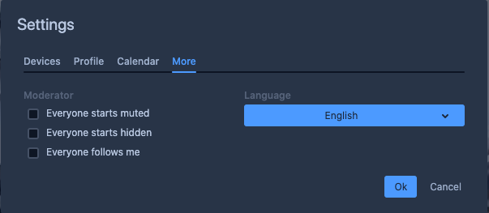

# User Guide to Jitsi

VERSION 20200419

AUTHOR Steve Magnuson, AG7GN

[Jitsi](https://jitsi.org) is a videoconferencing technology similar to Zoom.  Some of the features of Jitsi:

- It uses open source server software.
- You don't need an account to participate or moderate a Jitsi meeting
- There is no Jitsi client software for the PC.  It runs best in the [Chrome browser](https://www.google.com/chrome/index.html).  It will work on Mac, Windows, and Linux - any platform that can run the Chrome browser.
- There are apps available for Apple iOS and Android devices.  Search for the __Jitsi Meet__ app.
- Jitsi allows you to share your screen or an individual application.  Any participant can share their screen or an application at any time.
- Jitsi meetings can be password protected.
- You can't schedule a Jitsi meeting in advance.
- The person who starts the meeting is the moderator.
- A dial-in number and PIN are available once the moderator starts the meeting.
- The moderator has these privileges: 
	- Can toggle "Everyone starts muted"
	- Can toggle "Everyone starts hidden"
	- Can toggle "Everyone follows me"
- Any participant can mute all the other participants.

# Jitsi Screen

Instructions on starting a new meeting and joining a meeting follow.  Moving your mouse activates the menus and icons in the Jitsi browser interface.  

# Starting a Jitsi Meeting

These instructions are for the Chrome browser.  Starting a meeting from the iOS or Android app is a slightly different process.

1. Install the [Chrome browser](https://www.google.com/chrome/index.html) on your PC.  It will work on other browsers to varying degrees, but all of the features are implemented in Chrome.

1. Start Chrome.

1. Go to [meet.jit.si](https://meet.jit.si) and enter any *unique* string (no spaces or punctuation) in the __Start a new meeting__ field.  If someone else happens to be using the same string as you, when you click __Go__, you'll join their meeting!  So, make your string *unique*.

1. Click __Go__.

1. The first time you access Jitsi, your Chrome browser may ask permission to use your camera and audio device.

1. You'll likely see a Share window similar to this in the lower right corner:

	

	If you don't see it, click the "__i__ in the circle" icon in the lower right corner. 
	
1. (Optional) Click __Add password__ to protect the meeting.  You must press __ENTER__ for the password to "take".  Participants will need this password to join.

1. Click __Copy__ and paste into an email message to send to the other participants.  Note that if you set a meeting password, it is not included in the copy/paste, so you'll need to type it in the email or end it separately to participants.

1. Click the 3 dots in a vertical line (called a "kabob") in the lower right.  You'll see something like this:

	

	The very top item is your name as it appears to participants.  Click it, and you'll see something like this:
	
	
	
	Enter your first name and call sign so people know who you are.
	
1. On that same Settings window, select Devices to manage your audio and video devices.

	
	
1. As the first person to start the meeting, you'll have a __More__ item in the Settings screen, where you can make additional meeting-wide settings:

	
	
	- __Everyone starts muted__
		
		*All participants are muted with they join.*
	- __Everyone starts hidden__
		
		*All participants video feeds are disabled when the join (participants cannot see other participants' video feeds)*
	- __Everyone follows me__
		
		*All participants screen layout and view is the same as the presenter.*
		
1. Click __OK__ when done.

1. Click the "handset in the red circle" icon to leave the meeting.  Note that even if the moderator leaves the meeting, the meeting will continue until the last participant leaves.

# Joining a Jitsi Meeting

These instructions are for the Chrome browser.  Joining a meeting from the iOS or Android app is a slightly different process.

1. Whoever set up the meeting should have sent you an email message with a URL of the form:

		https://meet.jit.si/<string>
		
	where \<string\> is the meeting name set by the organizer.  There are no meeting numbers.  They may also have supplied you with a password if they chose to password protect the meeting.

1. Install the [Chrome browser](https://www.google.com/chrome/index.html) on your PC if it's not already installed.  Jitsi will work in other browsers to varying degrees, but all of the features are implemented in Chrome.

1. Start Chrome.

1. Go to the URL provided by the meeting organizer, or go to [meet.jit.si](https://meet.jit.si) and enter the name of the meeting (the string after the last '/' in the URL), then press __Go__.

1. The first time you join a Jitsi meeting, your Chrome browser may ask permission to use your camera and audio device.

1. Click the 3 dots in a vertical line (called a "kabob") in the lower right.  You'll see something like this:

	

	The very top item is your name as it appears to participants.  Click it, and you'll see something like this:
	
	
	
	Enter your first name and call sign so people know who you are.  Add your email address if desired (not necessary).
	
1. On that same Settings window, select Devices to manage your audio and video devices.

	
	
1. Click __OK__ when done.

1. Click the "handset in the red circle" icon to leave the meeting.  Note that even if the moderator leaves the meeting, the meeting will continue until the last participant leaves.

